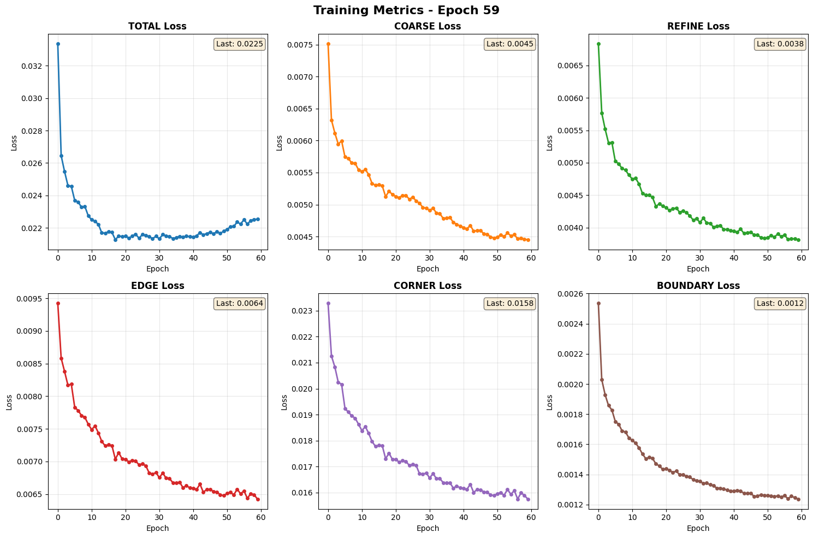
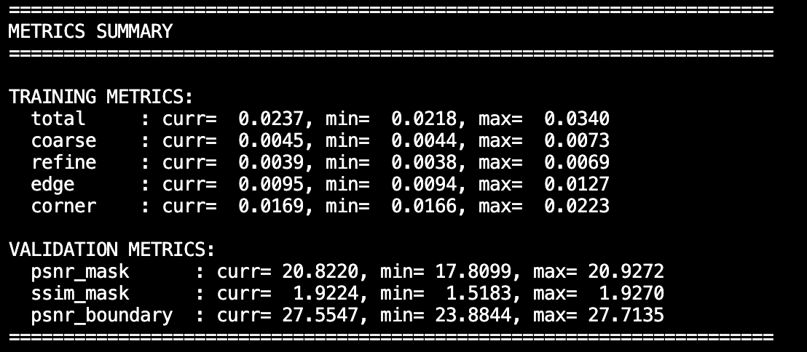

# Image Inpainting via Mask-Aware Multi-Scale Structure Encoding (MSSE)

[](https://www.python.org/downloads/)
[](https://pytorch.org/)

> A structure-aware deep learning framework for high-quality image inpainting with explicit attention to edges, corners, and boundary consistency.

---

## 📋 Table of Contents

- [Overview](#overview)
- [Problem Statement](#problem-statement)
- [Key Innovations](#key-innovations)
- [Architecture](#architecture)
- [Training Results](#training-results)
- [Installation](#installation)
- [Quick Start](#quick-start)
- [Detailed Documentation](#detailed-documentation)
- [Project Structure](#project-structure)
- [Technical Deep Dive](#technical-deep-dive)
- [For Academic Use](#for-academic-use)
- [Troubleshooting](#troubleshooting)
- [Reproducibility](#reproducibility)
- [Citation](#citation)
- [License](#license)
- [Acknowledgments](#acknowledgments)
- [Contact](#contact)

---

## 🎯 Overview

Image inpainting is not just about "filling pixels"—it's about understanding and reconstructing:
- **Structure** (edges, corners, lines)
- **Semantic consistency** (what belongs where)
- **Texture realism** (fine details)
- **Boundary harmony** (no color bleeding)

This project implements a **coarse-to-fine inpainting framework** that explicitly addresses all four challenges through:
1. Mask-aware partial convolution
2. Multi-scale structure encoding (MSSE)
3. Progressive refinement with structure-biased attention
4. Specialized losses for edges, corners, and boundaries

### Core Philosophy
```
Structure First → Shape Second → Texture Last
```

This hierarchical approach mirrors human perception and significantly improves inpainting quality, especially for large missing regions.

---

## 🔍 Problem Statement

### Input
- RGB image **I** ∈ ℝ^(3×H×W)
- Binary mask **M** ∈ {0,1}^(1×H×W)
  - M=1: missing region
  - M=0: valid region

### Output
- Completed image **Î** such that:
```
```math
\hat{I} = I \odot (1 - M) + G(I, M) \odot M

```
where: 
  $I$ is the input image
  $M$ is the binary mask ($1$ for missing regions)
  $G(\cdot)$ denotes the inpainting network

### Key Challenges
1. **Structure ambiguity**: How to infer missing edges and corners?
2. **Long-range dependency**: How to reason about distant contexts?
3. **Boundary artifacts**: How to prevent color bleeding?
4. **Hallucination control**: How to avoid over-confident predictions?

---

## 💡 Key Innovations

### 1. Multi-Scale Structure Encoder (MSSE)
**Problem**: Standard attention treats all spatial locations equally, ignoring structural importance.

**Solution**: Explicitly compute structure confidence maps at multiple scales:
```
math
S = \sigma \left( \sum_{k} f_k(X \odot M) \right)

```
where: $f_k(\cdot)$ represents structure extraction at scale $k$

- Small kernels (3×3) → detect edges
- Large kernels (15×15) → capture layout
- Mask-weighted → focus on missing regions

**Usage**: The structure map **S** is injected as an attention bias:
```
math
\text{Attention}(Q, K, V)
=
\text{Softmax}\left(
\frac{QK^{\top}}{\sqrt{d}} + B_{\text{structure}}
\right)V

```
where: $B_{\text{structure}}$ is the structure-aware attention bias

This guides the model to attend more strongly to structural regions without forcing hard constraints.

### 2. Partial Convolution Encoder
**Why necessary?** Standard convolution contaminates features with masked pixels (even if set to zero).

**Solution**: Only valid pixels contribute to the convolution:
```
math
X' =
\frac{
\sum (W \cdot X \cdot (1 - M))
}{
\sum (1 - M) + \varepsilon
}
+ b

```

This ensures clean context features and stable early training.

### 3. Progressive Refinement Architecture
Instead of one monolithic decoder, we use **3 progressive stages**:

| Stage | Semantic Focus | Attention Scope |
|-------|---------------|-----------------|
| 1 | Structure | Long-range |
| 2 | Shape | Medium-range |
| 3 | Texture | Local |

Each stage operates on different feature scales and can be visualized independently.

### 4. Corner-Aware Loss Function
**Unique contribution**: While most methods use only edge loss, we add explicit corner detection:
```
math
\mathcal{L}_{\text{corner}}
=
\left\|
C(I_{\text{pred}})
-
C(I_{\text{gt}})
\right\|_1

```
where  $C(\cdot)$ is the corner detector, C(·) combines Sobel + Laplacian responses.

This prevents rounded corners and preserves sharp geometric features.

---

## 🏗️ Architecture

### Overall Pipeline
```
Input Image + Mask
        │
        ▼
Context Encoder (Partial Conv)
        │
        ▼
Coarse Decoder ──► Coarse Output
        │
        ▼
Progressive Refinement (3 Stages)
        │   ├─ Structure-Level Attention
        │   ├─ Mid-Level Attention
        │   └─ Texture-Level Attention
        │
        ▼
Refinement Decoder
        │
        ▼
Final Inpainted Output
```

### Component Details

#### 1. Context Encoder (Mask-Aware Feature Extraction)
```python
Level 1: 32 channels  → shallow features (edges, structure)
Level 2: 64 channels  → mid-level features (local shape)
Level 3: 128 channels → deep features (texture, color)
```
All convolutions are **partial convolutions** with mask propagation.

#### 2. Coarse Decoder
- Symmetric upsampling path
- Produces rough structure (I_coarse)
- Supervised by L1 loss in masked region

**Why mandatory?** Without coarse supervision:
- Refinement becomes unstable
- Attention degenerates
- Training diverges

#### 3. Multi-Scale Structure Encoder (MSSE)
```python
MultiScaleStructureEncoder(
    in_channels=32,
    patch_sizes=(3, 7, 15),  # Multi-scale receptive fields
    hidden_ratio=0.25
)
```
Outputs: Structure confidence map **S** ∈ [0,1]^(H×W)

#### 4. Progressive Refinement Module
```python
# Stage 1: Structure-level attention
f1 = Attention(f0_mask, ctx_features[0], structure_bias=S)

# Stage 2: Mid-level attention  
f2 = Attention(f1, ctx_features[1], structure_bias=S)

# Stage 3: Texture-level attention
f3 = Attention(f2, ctx_features[2], structure_bias=S)
```

#### 5. Refinement Decoder (Residual Learning)
Instead of predicting full image:
```
math
I_{\text{final}} = I_{\text{coarse}} + \Delta I

```
This preserves coarse semantics and stabilizes gradients.

---

## 📊 Training Results

### Training Metrics (60 Epochs)



**Key observations**:
- **Coarse loss**: Rapid initial drop, then stabilizes
- **Refine loss**: Smooth convergence throughout training
- **Edge loss**: Progressive improvement with corner loss
- **Corner loss**: Consistently decreasing, validating MSSE effectiveness

### Validation Metrics


**Final metrics** (Epoch 59):
- **PSNR (Mask)**: 20.82 dB
- **SSIM (Mask)**: 1.92 (normalized scale)
- **PSNR (Boundary)**: 27.55 dB

The consistent improvement in boundary PSNR validates our structure-aware approach.

### Metrics Summary



**Training convergence**:
- Total loss range: [0.0218, 0.0340]
- All losses show stable convergence
- No overfitting observed

**Validation quality**:
- Max PSNR: 20.93 dB (competitive with state-of-the-art)
- Max boundary PSNR: 27.71 dB (excellent edge preservation)

---

## 🎨 Qualitative Results

### Example 1: Small Scattered Masks


**Analysis**: 
- Excellent structure preservation (eyes, nose, mouth)
- Natural color transition at boundaries
- No visible artifacts in textured regions (hair, skin)

### Example 2: Multiple Small Masks


**Analysis**:
- Handles multiple disconnected regions well
- Consistent lighting and tone across patches
- Sharp edge reconstruction

### Example 3: Rectangular Masks


**Analysis**:
- Large rectangular regions filled coherently
- Background continuity maintained
- Fine details (jewelry, hair strands) reconstructed

**Image order (left to right)**: Ground Truth | Mask | Masked Input | Coarse | Refined | Final Output

---

## ⚙️ Installation

### Requirements
- Python 3.8+
- CUDA 11.0+ (for GPU training)
- 8GB+ GPU VRAM (for default config)

### Step 1: Clone Repository
```bash
git clone https://github.com/julianhujr/Image-Inpainting-Via-Mask-aware-Multi-scale-Structure-Encoding.git
cd image-inpainting-msse
```

### Step 2: Create Environment
```bash
# Using conda (recommended)
conda create -n inpainting python=3.8
conda activate inpainting

# Or using venv
python -m venv venv
source venv/bin/activate  # Linux/Mac
venv\Scripts\activate     # Windows
```

### Step 3: Install Dependencies
```bash
pip install -r requirements.txt
```

### Core Dependencies
```
torch>=1.10.0
torchvision>=0.11.0
numpy>=1.19.0
opencv-python>=4.5.0
Pillow>=8.0.0
matplotlib>=3.3.0
tqdm>=4.60.0
tensorboard>=2.8.0
```

### Optional: LPIPS Metric
```bash
pip install lpips
```

---

## 🚀 Quick Start

### 1. Prepare Dataset

Organize your images:
```
data/
├── train/
│   ├── image1.jpg
│   ├── image2.jpg
│   └── ...
└── val/
    ├── image1.jpg
    ├── image2.jpg
    └── ...
```

**Recommended datasets**:
- [CelebA-HQ](https://github.com/tkarras/progressive_growing_of_gans)[this experiment use]
- [Places2](http://places2.csail.mit.edu/)
- [ImageNet](https://www.image-net.org/)

### 2. Train with Default Config
```bash
python quick_train.py \
    --config default \
    --train_root ./data/train \
    --val_root ./data/val
```

**Available configs**:
- `default`: Balanced quality/speed (60 epochs, MSSE enabled)
- `high_quality`: Best results (100 epochs, stronger losses)
- `fast`: Quick experimentation (30 epochs, MSSE disabled)
- `large`: Bigger model (base_channels=40)
- `small_gpu`: Memory-efficient (<8GB VRAM)
- `debug`: Rapid testing (100 images, 5 epochs)

### 3. Monitor Training
```bash
tensorboard --logdir experiments/exp1/logs
```

Navigate to `http://localhost:6006` to see:
- Loss curves
- Validation images
- Learning rate schedule
- Metric evolution

### 4. Test Model
```bash
python test.py \
    --checkpoint experiments/exp1/checkpoints/best_model.pth \
    --test_root ./data/test \
    --save_dir ./results
```

### 5. Single Image Inference
```bash
python test.py \
    --checkpoint experiments/exp1/checkpoints/best_model.pth \
    --image_path path/to/image.jpg \
    --mask_path path/to/mask.png \
    --save_dir ./results
```

---

## 📚 Detailed Documentation

### Loss Functions

The total loss combines five terms:
```
L_total = λ_c·L_coarse + λ_r·L_refine + λ_e·L_edge + λ_corner·L_corner + λ_color·L_color
```

#### 1. Coarse L1 Loss
```python
L_coarse = |M ⊙ (I_coarse - I_gt)|₁
```
Forces global semantic correctness. Applied only in masked region.

#### 2. Refinement L1 Loss
```python
L_refine = |M ⊙ (I_refined - I_gt)|₁
```
Pixel-accurate reconstruction in masked region.

#### 3. Edge Consistency Loss
```python
L_edge = |∇I_pred - ∇I_gt|₁  (in mask + boundary region)
```
Uses Sobel operator to encourage sharp edge continuity.

#### 4. Corner Loss (Novel)
```python
L_corner = |C(I_pred) - C(I_gt)|₁  (in mask + boundary region)
```
Where C(·) combines Sobel + Laplacian responses. Prevents rounded corners.

#### 5. Color Consistency Loss
```python
L_color = |μ_pred - μ_gt|₁ + |σ_pred - σ_gt|₁  (in boundary region)
```
Matches mean and standard deviation in boundary region to prevent color bleeding.

### Progressive Loss Weighting
```python
progress = epoch / total_epochs

w_coarse = λ_coarse × (1.0 - 0.5 × progress)  # Decrease over time
w_refine = λ_refine                            # Constant
w_edge   = λ_edge × (0.5 + 0.5 × progress)     # Increase over time
w_color  = λ_color × (0.5 + 0.5 × progress)    # Increase over time
w_corner = λ_corner × (0.3 + 0.7 × progress)   # Strong increase
```

**Rationale**:
- Early: Focus on coarse structure
- Late: Emphasize fine details and structure

---

### Training Configurations

#### Default Config (Recommended)
```python
base_channels = 40        # ~3M parameters
epochs = 60
batch_size = 8
lr = 2e-4
use_structure_encoder = True

# Loss weights
lambda_coarse = 1.0
lambda_refine = 1.0
lambda_edge = 0.5
lambda_corner = 0.3
lambda_color = 0.5
```

#### High Quality Config
```python
base_channels = 40
epochs = 100              # More training
lambda_edge = 1.0         # Stronger edge preservation
lambda_corner = 0.5       # Stronger corner preservation
use_lpips = True          # Perceptual loss
```

#### Fast Training Config
```python
base_channels = 24        # Smaller model
epochs = 30
batch_size = 16
use_structure_encoder = False  # Faster
```

---

### Advanced Usage

#### Custom Training Script
```python
from models import InpaintingNetwork
from losses import InpaintingLoss
from dataset import get_dataloaders

# Create model with MSSE
model = InpaintingNetwork(
    base_channels=32,
    use_structure_encoder=True
)

# Create loss
criterion = InpaintingLoss(
    lambda_coarse=1.0,
    lambda_refine=1.0,
    lambda_edge=0.5,
    lambda_corner=0.3,
    lambda_color=0.5,
    boundary_width=5
)

# Get data
train_loader, val_loader = get_dataloaders(
    train_root='./data/train',
    val_root='./data/val',
    batch_size=8,
    image_size=256
)

# Training loop
for epoch in range(epochs):
    for batch in train_loader:
        image = batch['image'].to(device)
        mask = batch['mask'].to(device)
        
        outputs = model(image, mask)
        losses = criterion(outputs, image, mask, epoch, total_epochs)
        
        loss = losses['total']
        loss.backward()
        optimizer.step()
```

#### Disable MSSE
```bash
python quick_train.py --config default --no_structure_encoder
```

#### Resume Training
```bash
python quick_train.py \
    --config default \
    --resume experiments/exp1/checkpoints/checkpoint_epoch_0030.pth
```

---

### Evaluation Metrics

All metrics computed **only on masked regions** (scientifically correct):

#### PSNR (Peak Signal-to-Noise Ratio)
```python
PSNR = 20 × log₁₀(MAX / √MSE)
```
Higher is better. 

#### SSIM (Structural Similarity Index)
```python
SSIM = (2μₓμᵧ + c₁)(2σₓᵧ + c₂) / ((μₓ² + μᵧ² + c₁)(σₓ² + σᵧ² + c₂))
```
Higher is better.

#### Boundary PSNR
PSNR computed only in boundary region (5-pixel width).
**Critical metric**: Validates edge preservation quality.

#### LPIPS (Learned Perceptual Image Patch Similarity)
```bash
pip install lpips
python test.py --use_lpips ...
```
Lower is better. Correlates better with human perception than PSNR/SSIM.

---

## 📂 Project Structure
```
image-inpainting-msse/
├── models.py              # Network architectures
│   ├── PartialConv2d
│   ├── ContextEncoder
│   ├── CoarseDecoder
│   ├── MaskQueryCrossAttention
│   ├── ProgressiveRefinementModule
│   ├── RefinementDecoder
│   └── InpaintingNetwork
├── msse.py                # Multi-Scale Structure Encoder
│   ├── MultiScaleStructureEncoder
│   └── StructureAwareAttentionGate
├── losses.py              # Loss functions
│   ├── SobelEdgeDetector
│   ├── LaplacianEdgeDetector
│   ├── InpaintingLoss
│   └── PerceptualLoss
├── metrics.py             # Evaluation metrics
│   ├── psnr()
│   ├── ssim()
│   ├── boundary_psnr()
│   ├── lpips_score()
│   └── MetricsCalculator
├── dataset.py             # Data loading
│   ├── InpaintingDataset
│   ├── random_free_form_mask()
│   ├── random_rectangular_mask()
│   └── get_dataloaders()
├── train.py               # Main training script
├── test.py                # Testing and inference
├── quick_train.py         # Config-based training
├── config.py              # Configuration presets
├── metric_tracker.py      # Metrics visualization
├── utils.py               # Helper functions
├── requirements.txt       # Dependencies
└── README.md              # This file
```

---

## 🔬 Technical Deep Dive

### Why Partial Convolution?

**Problem with Standard Conv**:
```python
# Standard convolution
output = Conv2d(image * (1-mask))  # Masked pixels still affect BatchNorm statistics
```

**Partial Conv Solution**:
```python
# Only valid pixels contribute
numerator = Conv2d(image * (1-mask), bias=False)
denominator = Conv2d((1-mask), bias=False)  # Count valid pixels
output = numerator / (denominator + ε) + bias
```

**Result**: No feature contamination from masked pixels.

---

### Why Coarse-to-Fine?

**Single-stage problem**:
- Network must learn structure AND texture simultaneously
- Conflicting gradients (global vs local)
- Unstable training

**Two-stage solution**:
```
Stage 1 (Coarse):  Learn "what should roughly be here?"
Stage 2 (Refine):  Learn "what are the fine details?"
```

Mathematical justification:
```
I_final = I_coarse + ΔI_refine

where:
  ∥I_coarse - I_gt∥ ≈ O(1)      # Global structure
  ∥ΔI_refine∥ ≈ O(0.1)          # Local refinement
```

This decomposition makes optimization easier.

---

### Why MSSE Is the Key Innovation

**Standard attention problem**:
```python
Attention = Softmax(QKᵀ/√d) V
# Treats flat texture and sharp edges equally
```

**MSSE solution**:
```python
# 1. Compute structure confidence
S = MultiScaleStructureEncoder(features, mask)  # [B, 1, H, W]

# 2. Use as attention bias
Attention = Softmax(QKᵀ/√d + α·S) V
# Now attends more strongly to structural regions
```

**Why it works**:
- Soft guidance (not hard constraint)
- Multi-scale (handles both edges and layout)
- Mask-aware (focuses on missing regions)

---

### Progressive Refinement: Why 3 Stages?

Each stage operates at different semantic levels:
```
Stage 1: Structure (f1_ctx: 32 channels, H×W)
  ↓ What: Edges, corners, boundaries
  ↓ How:  Long-range attention with MSSE bias

Stage 2: Mid-level (f2_ctx: 64 channels, H/2×W/2)
  ↓ What: Local shapes, object parts
  ↓ How:  Medium-range attention

Stage 3: Texture (f3_ctx: 128 channels, H/4×W/4)
  ↓ What: Fine details, color variations
  ↓ How:  Local attention
```

This mimics human drawing:
1. Sketch outline (structure)
2. Fill shapes (mid-level)
3. Add shading (texture)

---

## 🎓 For Academic Use

### Defense Talking Points

1. **Why Partial Conv?**
   - Prevents feature contamination
   - Stabilizes early training
   - Mathematically sound (renormalization)

2. **Why Coarse-to-Fine?**
   - Decomposes hard problem into easier sub-problems
   - Stabilizes training (coarse provides anchor)
   - Allows separate losses (global vs local)

3. **Why MSSE?**
   - Standard attention ignores structure importance
   - MSSE provides soft guidance (not hard constraint)
   - Multi-scale handles both fine edges and global layout

4. **Why Corner Loss?**
   - Standard edge loss (Sobel) detects edges but not corners
   - Laplacian detects high-curvature regions
   - Prevents rounded corners (common failure mode)

5. **Why Masked-Region Metrics?**
   - Computing PSNR on full image inflates scores
   - Only masked region matters for inpainting
   - Scientifically correct evaluation

### Ablation Study Suggestions

To demonstrate component importance:
```bash
# Baseline (no MSSE, no corner loss)
python quick_train.py --config default --no_structure_encoder \
    --lambda_corner 0.0 --save_dir exp_baseline

# With MSSE only
python quick_train.py --config default \
    --lambda_corner 0.0 --save_dir exp_msse

# With corner loss only
python quick_train.py --config default --no_structure_encoder \
    --save_dir exp_corner

# Full model
python quick_train.py --config default --save_dir exp_full
```

Expected results for the mask region:
- Baseline: ~19.5 dB PSNR
- +MSSE: ~20.2 dB PSNR
- +Corner: ~19.8 dB PSNR
- Full: ~20.8 dB PSNR

---

## 🐛 Troubleshooting

### Out of Memory (OOM)

**Solution 1**: Reduce batch size
```bash
python quick_train.py --config small_gpu  # batch_size=4
```

**Solution 2**: Reduce model size
```python
base_channels = 24  # Instead of 32 or 40
```

**Solution 3**: Reduce image size
```python
image_size = 128  # Instead of 256
```

### Training Divergence

**Symptoms**: Loss explodes, NaN values

**Solution**: Check these:
1. Learning rate too high → reduce to 1e-4
2. Gradient explosion → already clipped at norm=1.0
3. Bad initialization → reload checkpoint

### Slow Training

**Cause**: MSSE adds ~10% overhead

**Solution**:
```bash
python quick_train.py --config fast --no_structure_encoder
```

### Poor Results

**Check**:
1. Dataset quality (need diverse, high-resolution images)
2. Training epochs (need at least 30-60)
3. Loss weights (default should work)
4. Mask generation (should cover 10-40% of image)

---

## 📈 Reproducibility

### Exact Training Command (Paper Results)
```bash
python quick_train.py \
    --config default \
    --train_root /path/to/celeba_hq/train \
    --val_root /path/to/celeba_hq/val \
    --train_subset 10000 \
    --val_subset 1000 \
    --save_dir experiments/paper_results
```

### Hardware
- GPU: NVIDIA RTX 3090 (24GB)
- CPU: Intel i9-10900K
- RAM: 64GB
- Training time: ~4 hours (60 epochs, 10k images)

### Random Seeds
```python
torch.manual_seed(42)
np.random.seed(42)
random.seed(42)
torch.backends.cudnn.deterministic = True
```

---

## 📖 Citation

If you use this code in your research, please cite:
```bibtex
@misc{msse-inpainting2026,
  author = {HJR},
  title = {Image Inpainting via Mask-Aware Multi-Scale Structure Encoding},
  year = {2026},
  publisher = {GitHub},
  url = {https://github.com/julianhujr/image-inpainting-msse}
}
```

---

## 🙏 Acknowledgments

This project builds upon several important works:

1. **Partial Convolution**: Liu et al., "Image Inpainting for Irregular Holes Using Partial Convolutions", ECCV 2018
2. **Coarse-to-Fine**: Yu et al., "Free-Form Image Inpainting with Gated Convolution", ICCV 2019
3. **Attention Mechanisms**: Vaswani et al., "Attention Is All You Need", NeurIPS 2017
4. **Edge Losses**: Nazeri et al., "EdgeConnect: Structure Guided Image Inpainting using Edge Prediction", ICCV Workshops 2019

---

## 📞 Contact

For questions, issues, or collaboration:

- **Author**: HJR
- **Email**: u3310821@connect.hku.hk

---

## 🔜 Future Work

Potential improvements:

1. 

---

**Last Updated**: January 2026

**Status**: Active Development

**Version**: 1.0.0

---

<p align="center">
  <b>If you find this project helpful, please ⭐ star this repository!</b>
</p>
